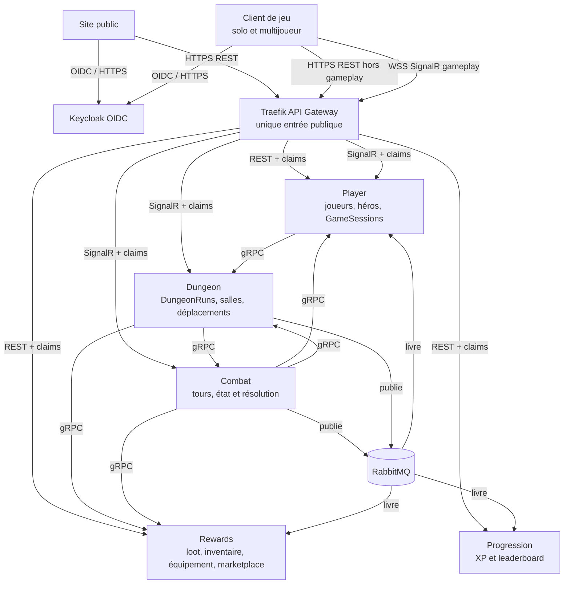
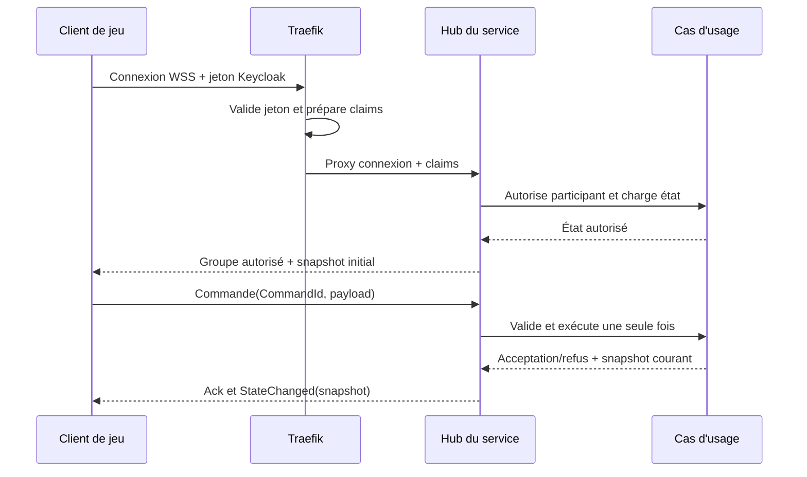
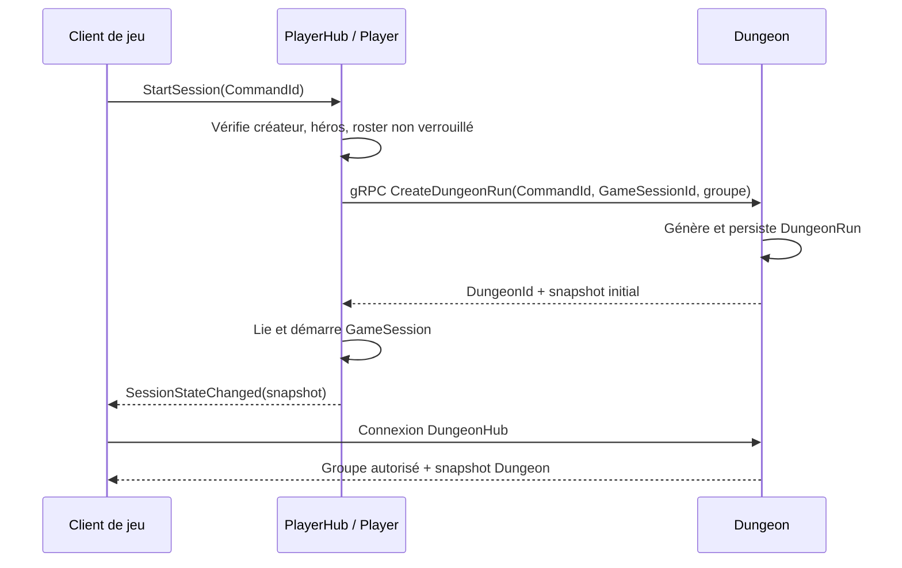
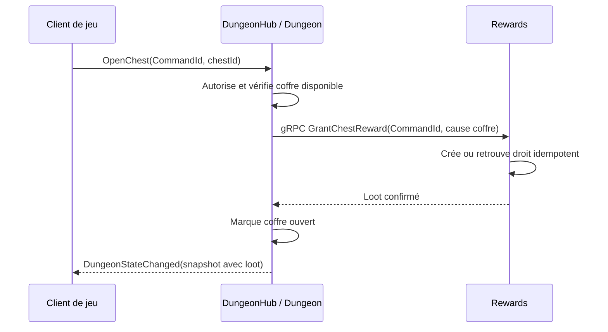
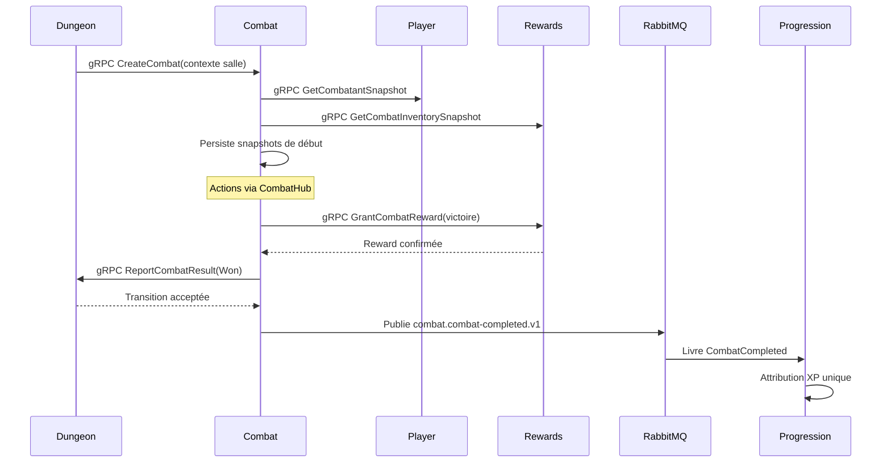

# Architecture des communications microservices

> Référence détaillée de la cible MVP : frontend, Traefik, Keycloak, Player, Dungeon, Combat, Rewards, Progression et RabbitMQ.

## 1. Vue macro

Le produit compte exactement cinq microservices métier : **Player**, **Dungeon**, **Combat**, **Rewards** et **Progression**. Ils sont privés dans Kubernetes. **Traefik** est l'unique entrée backend publique. **Keycloak** est le fournisseur d'identité technique, pas un microservice métier.

| Besoin | Transport | Frontière |
|---|---|---|
| Fonction frontend hors gameplay | HTTPS/REST, JSON | Frontend → Traefik → service propriétaire |
| Gameplay solo et multijoueur | SignalR sur WebSocket | Client de jeu → Traefik → Hub propriétaire |
| Résultat interne immédiat | gRPC, Protobuf | Service → service, réseau interne |
| Fait métier différable | RabbitMQ, Protobuf versionné | Producteur → consommateur indépendant |



### Règles de frontière

- Traefik valide le jeton Keycloak, retire/remplace les headers internes forgés par le client et transmet `UserId`, `Username`, rôles et `CorrelationId` comme claims de confiance.
- Traefik proxy les upgrades WebSocket et les Hubs ; il ne conserve pas d'état gameplay, ne consomme pas les messages RabbitMQ et ne devient pas un BFF.
- Chaque service autorise sa ressource. Un jeton valide ne donne jamais accès à la session, au donjon ou au combat d'un autre joueur.
- Aucun microservice n'est exposé directement à Internet et aucun ne lit/écrit la base d'un autre service.

## 2. Ownership et responsabilités

| Propriétaire | Source de vérité | Ne possède pas |
|---|---|---|
| Player | Identité métier, héros, `GameSession`, créateur, roster et héros choisis | Jetons, équipement, donjon, XP |
| Dungeon | `DungeonRun`, génération, environ 40 salles/intérieurs, positions, salles et cycle du run | Héros, combat, loot, XP |
| Combat | Instance, tours, état autoritatif, résultat et snapshots de début | Identité durable, inventaire, DungeonRun, XP |
| Rewards | Droit à récompense, loot, objets, consommables, inventaire, équipement, marketplace/paiement | Combat, cycle de run, XP |
| Progression | XP, niveau, historique des faits et projections leaderboard | Authentification, session, héros, inventaire |

Une `GameSession` n'est ni une session de connexion ni un `DungeonRun`. Player possède le groupe et les héros choisis ; Dungeon possède le run généré. La session démarrée référence un run. Seul le créateur démarre ou abandonne et le roster est verrouillé au démarrage. Voir ADR-GLOB-011.

## 3. Frontend : HTTPS/REST et SignalR

### HTTPS/REST, exclusivement hors gameplay

| Routes Gateway | Propriétaire | Opérations |
|---|---|---|
| `/api/player/...` | Player | Profil, création, lecture et sélection héros |
| `/api/rewards/...` | Rewards | Inventaire, équiper/déséquiper hors combat, marketplace/achat |
| `/api/progression/...` | Progression | XP, historique, leaderboard |
| Endpoints OIDC | Keycloak | Connexion, acquisition/renouvellement token |

Les payloads REST sont JSON. Les contrôleurs sont des frontières applicatives fines et ne doivent pas dupliquer en HTTP une commande de gameplay déjà portée par un Hub.

### SignalR/WebSocket, pour tout gameplay

Les mêmes commandes servent en solo et en multijoueur. Le Hub autorise le participant, l'ajoute à un groupe créé par le service, puis retourne un snapshot initial complet. Le client ne choisit jamais un groupe.

| Hub | Route | Propriétaire | Groupe | Commandes | Événement |
|---|---|---|---|---|---|
| `PlayerHub` | `/hubs/player` | Player | `session:{SessionId}` | Créer, rejoindre, démarrer, abandonner | `SessionStateChanged` |
| `DungeonHub` | `/hubs/dungeons` | Dungeon | `dungeon:{DungeonId}` | Snapshot, déplacement, salle, coffre | `DungeonStateChanged` |
| `CombatHub` | `/hubs/combats` | Combat | `combat:{CombatId}` | Snapshot, action, passer, potion | `CombatStateChanged` |

Chaque commande porte un `CommandId` unique. Le Hub retourne explicitement acceptation/refus. Chaque changement accepté diffuse un snapshot complet autoritatif : les retries et resynchronisations deviennent sûrs.



Dungeon et Combat ont un replica chacun dans le MVP. Aucun backplane SignalR Redis n'est actif, mais les groupes existent déjà afin de l'ajouter plus tard sans changer le protocole frontend.

## 4. Échanges gRPC synchrones

Les contrats gRPC sont des packages NuGet Protobuf versionnés et possédés par leur producteur. Chaque appel transporte la corrélation, a une deadline et ne peut être retry qu'avec la même clé d'idempotence lorsque cela est sûr.

| Appelant → appelé | Opération | Déclencheur / requête | Résultat et règle |
|---|---|---|---|
| Player → Dungeon | `CreateDungeonRun` | Démarrage ; `CommandId`, `GameSessionId`, groupe, héros | `DungeonId` + snapshot. Même commande = run existant, jamais second run. |
| Player → Dungeon | `AbandonDungeonRun` | Abandon créateur ; commande, session, donjon | Confirmation `Abandoned`, répétition = même état final. |
| Dungeon → Combat | `CreateCombat` | Salle combat ; commande, run, salle/rencontre, participants | `CombatId` + snapshot. Une cause de salle ne crée pas deux combats. |
| Combat → Player | `GetCombatantSnapshot` | Initialisation ; héros/participants | Snapshot héros immuable ; échec interdit l'initialisation sûre. |
| Combat → Rewards | `GetCombatInventorySnapshot` | Initialisation ; héros | Snapshot équipement/consommables ; échec interdit l'initialisation sûre. |
| Dungeon → Rewards | `GrantChestReward` | Coffre ; commande, cause run/salle/coffre, destinataire | Loot persisté. Coffre ouvert après confirmation. |
| Combat → Rewards | `GrantCombatReward` | Victoire ; commande, combat/cause, destinataires | Loot avant finalisation. Boss final : reward de boss seulement. |
| Combat → Dungeon | `ReportCombatResult` | Fin ; commande, combat, salle, `Won`/`Lost` | Transition salle/run. `Won` après reward confirmée. |

Combat persiste les snapshots Player et Rewards obtenus à sa création. Un changement d'équipement ultérieur ne modifie pas ce combat. Le frontend bloque équiper/déséquiper en combat ; le MVP n'ajoute pas de réservation backend.

## 5. Échanges RabbitMQ asynchrones

RabbitMQ transporte des faits métier sans réponse immédiate. Sa redélivrance fournit un traitement at-least-once et impose des consommateurs idempotents. Chaque payload est un contrat Protobuf versionné du package producteur, dans une enveloppe avec `messageId`, `correlationId`, `causationId`, `messageType`, `version`, `occurredAt`, `producer` et payload typé.

Les événements sont publiés dans des exchanges durables avec des clés de routage versionnées. Chaque service consommateur possède une file durable liée aux clés de routage qu'il consomme. Les messages ne sont acquittés qu'après un traitement réussi ; les retries et le routage vers une dead-letter exchange prennent en charge les échecs sans coupler producteurs et consommateurs.

| Clé de routage | Producteur → file du consommateur | Publication | Effet consommateur |
|---|---|---|---|
| `combat.consumable-used.v1` | Combat → Rewards | Potion déjà appliquée au snapshot Combat local | Consomme une fois l'objet ; `CommandId`, héros, item, quantité. |
| `combat.combat-completed.v1` | Combat → Progression | Combat gagné, reward confirmée, résultat Dungeon accepté | Attribue XP une fois et met à jour projections ; XP non temps réel. |
| `dungeon.dungeon-run-ended.v1` | Dungeon → Player | Run `Won`, `Lost` ou `Abandoned` | Ferme `GameSession`, diffuse `SessionStateChanged`. |

La Gateway ne consomme jamais de messages RabbitMQ. Un consommateur ne modifie que son propre état puis expose un effet client par son API REST ou son Hub.

## 6. Séquences critiques

### Démarrage du run



### Coffre et reward



### Combat gagné



`CombatCompleted` est produit après confirmation de reward et acceptation Dungeon. Une défaite reporte `Lost`, sans reward et sans `CombatCompleted`.

### Potion et fin de run

```mermaid
sequenceDiagram
  participant F as Client de jeu
  participant C as CombatHub / Combat
  participant M as RabbitMQ
  participant R as Rewards
  participant D as Dungeon
  participant P as Player
  F->>C: ConsumePotion(CommandId, itemId)
  C->>C: Met à jour snapshot Combat local
  C-->>F: CombatStateChanged(snapshot)
  C->>M: Publie combat.consumable-used.v1
  M->>R: Livre ; consomme item une seule fois
  D->>M: Publie dungeon.dungeon-run-ended.v1
  M->>P: Livre DungeonRunEnded
  P->>P: Ferme GameSession
  P-->>P: PlayerHub SessionStateChanged
```

## 7. Fiabilité, cohérence et observabilité

| Sujet | Règle |
|---|---|
| Replay commande | Conserver `CommandId` et retourner résultat antérieur plutôt que répéter transition. |
| Doublon événement | Dédupliquer par `messageId` ou clé métier : jamais deux consommations, XP ou clôtures incohérentes. |
| Timeout gRPC | Résultat inconnu ; retry seulement avec même clé d'idempotence. |
| Reward obligatoire | Coffre/victoire = barrières synchrones ; échec = pending/retryable, jamais faussement terminé. |
| Délai RabbitMQ | Cohérence éventuelle dans état propriétaire ; Gateway n'attend jamais un consommateur. |
| Traces | `CorrelationId` traverse Gateway, Hub, gRPC et RabbitMQ ; `CausationId` relie les événements dérivés. |
| Logs | Inclure `GameSessionId`, `DungeonId`, `CombatId`, héros, `CommandId`, cause reward et `messageId`. |

## 8. Non mis en place à l'initialisation

- Pas de backplane Redis ni de Hub Dungeon/Combat multi-replica initialement.
- Aucun join d'un `DungeonRun` actif et aucun abandon individuel.
