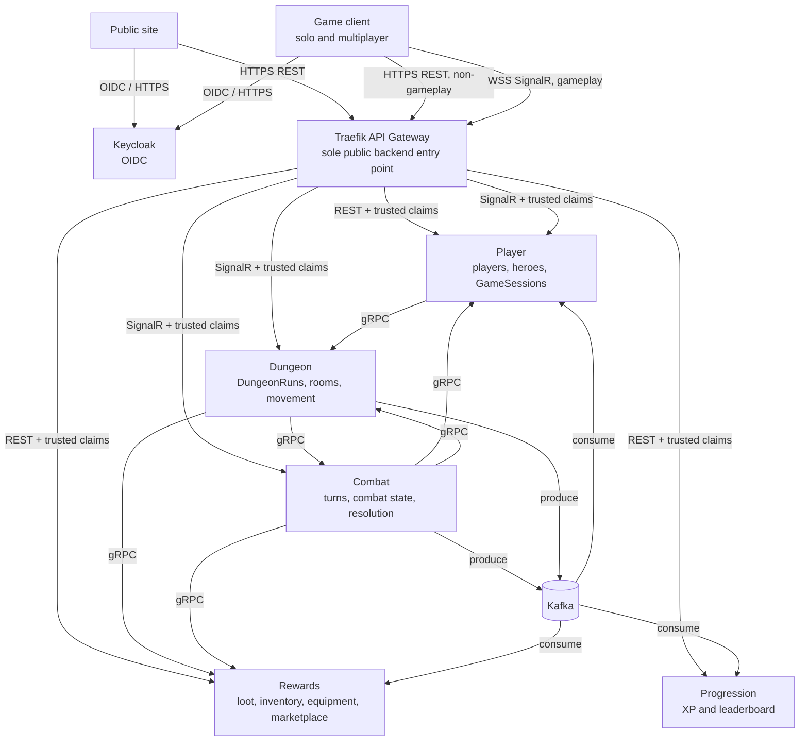
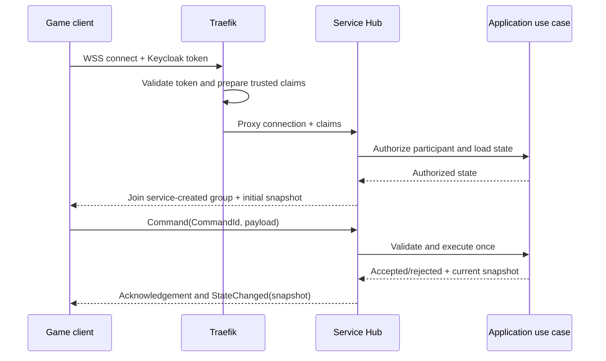
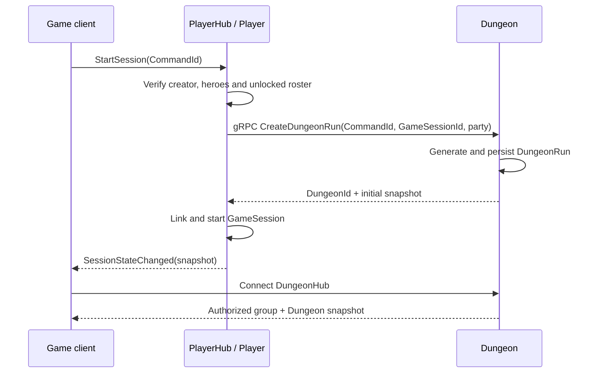
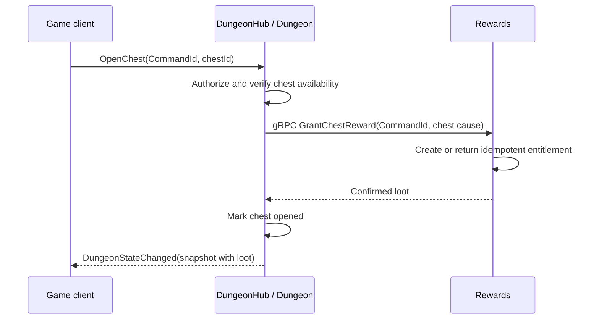
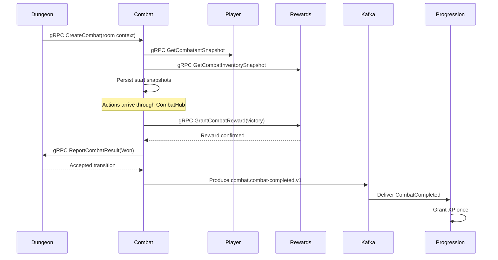
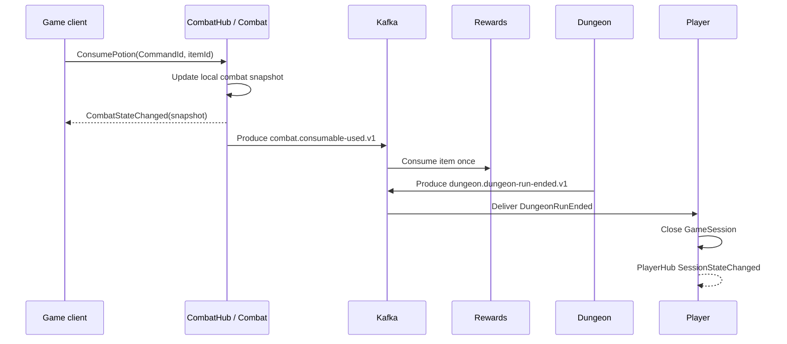

# Microservice communication architecture

> Detailed MVP reference for communications between the frontend, Traefik,
> Keycloak, Player, Dungeon, Combat, Rewards, Progression and Kafka.

## 1. Macro view

The system contains exactly five business microservices: **Player**, **Dungeon**,
**Combat**, **Rewards**, and **Progression**. They are private Kubernetes
workloads. **Traefik** is their only public entry point and **Keycloak** is the
technical identity provider, not a business microservice.

| Need | Transport | Boundary |
|---|---|---|
| Non-gameplay frontend operation | HTTPS/REST, JSON | Frontend to Traefik to owning service |
| Gameplay, in solo and multiplayer | SignalR over WebSocket | Game client to Traefik to owning Hub |
| Immediate internal answer | gRPC, Protobuf | Service to service, internal network |
| Deferred business fact | Kafka, versioned Protobuf | Producer to independent consumer |

### Gateway and identity rules

- Traefik validates the Keycloak token, strips or overwrites client-supplied
  internal identity headers, and forwards normalized claims: `UserId`,
  `Username`, roles and `CorrelationId`.
- Traefik proxies WebSocket upgrades and Hub traffic. It does not hold gameplay
  state, consume Kafka events or become a BFF.
- A service authorizes each resource itself. A valid token never permits joining
  another player's session, dungeon or combat.
- No service accesses another service's database or is exposed directly to the
  internet.

## 2. Ownership and responsibilities

| Owner | Source of truth | Explicitly not owned |
|---|---|---|
| Player | Player business identity, heroes, `GameSession`, creator, roster and selected heroes | Tokens, equipment, dungeon state, XP |
| Dungeon | `DungeonRun`, random generation, around 40 rooms, interiors, positions, rooms and run lifecycle | Heroes, combat resolution, loot, XP |
| Combat | Combat instance, turn order, authoritative combat state, combat result and start snapshots | Durable hero identity, inventory, DungeonRun, XP |
| Rewards | Reward entitlement, loot, items, consumables, inventory, equipped inventory, marketplace/payment order | Combat state, run lifecycle, XP |
| Progression | XP, level/progression, fact history and leaderboard projections | Authentication, session, hero ownership and inventory |

A `GameSession` is not a technical login session and is not a `DungeonRun`.
Player owns the party and selected heroes; Dungeon owns the generated run. A
started session references one run. Only its creator starts or abandons the run;
the roster is locked once it starts. See ADR-GLOB-011.

## 3. Frontend communication

### 3.1 HTTPS/REST for non-gameplay

| Gateway route family | Owner | Operations |
|---|---|---|
| `/api/player/...` | Player | Read profile, create/select/read heroes |
| `/api/rewards/...` | Rewards | Read inventory, equip/unequip outside combat, marketplace/purchase |
| `/api/progression/...` | Progression | Read XP, history and leaderboard |
| OIDC endpoints | Keycloak | Sign-in, token acquisition and renewal |

REST payloads are JSON. Controllers are thin application boundaries and must not
create an HTTP duplicate of a gameplay Hub command.

### 3.2 SignalR/WebSocket for all gameplay

The game client uses identical gameplay commands for solo and multiplayer. A Hub
checks participant membership, joins a service-created group, then sends a full
initial snapshot. Clients never select a group name.

| Hub | Traefik route | Owner | Group | Commands | Published snapshot event |
|---|---|---|---|---|---|
| `PlayerHub` | `/hubs/player` | Player | `session:{SessionId}` | Create, join, start, abandon session | `SessionStateChanged` |
| `DungeonHub` | `/hubs/dungeons` | Dungeon | `dungeon:{DungeonId}` | Snapshot, move, enter room, open chest | `DungeonStateChanged` |
| `CombatHub` | `/hubs/combats` | Combat | `combat:{CombatId}` | Snapshot, action, pass turn, consume potion | `CombatStateChanged` |

Every command includes a unique `CommandId`. The Hub replies explicitly with an
accepted/rejected acknowledgement; an accepted state change produces a complete
authoritative snapshot. This makes replay and client resynchronization safe.

Dungeon and Combat run one replica each in the MVP. There is no Redis SignalR
backplane yet, but groups are used from the start so a Redis backplane can be
added later without changing the frontend protocol.

## 4. Synchronous gRPC exchanges

gRPC contracts are producer-owned, versioned Protobuf NuGet packages. Calls
carry correlation context, have a deadline, and are retried only with the same
idempotency key when retrying is safe.

| Caller → callee | Operation | When / request essentials | Required result and rule |
|---|---|---|---|
| Player → Dungeon | `CreateDungeonRun` | Creator starts session; `CommandId`, `GameSessionId`, party and selected heroes | `DungeonId` + initial snapshot. Same command returns existing run; no second run. |
| Player → Dungeon | `AbandonDungeonRun` | Creator abandons; `CommandId`, session and dungeon IDs | Confirmation of `Abandoned`. A repeated request returns the same terminal result. |
| Dungeon → Combat | `CreateCombat` | A combat room is entered; command, run, room/encounter and participant context | `CombatId` + initial snapshot. Same room cause must not create two combats. |
| Combat → Player | `GetCombatantSnapshot` | Combat initialization; hero/participant IDs | Immutable relevant hero snapshot. Failure prevents safe initialization. |
| Combat → Rewards | `GetCombatInventorySnapshot` | Combat initialization; hero IDs | Equipped inventory and consumable snapshot. Failure prevents safe initialization. |
| Dungeon → Rewards | `GrantChestReward` | Open chest; command, run/room/chest cause, recipient | Persisted loot. Chest is not marked opened until confirmed. |
| Combat → Rewards | `GrantCombatReward` | Win; command, combat/victory cause, recipients | Persisted loot before victory finalization. Final boss has final-boss reward only. |
| Combat → Dungeon | `ReportCombatResult` | Combat finishes; command, combat, room and `Won`/`Lost` result | Updated room/run state. A win is reported only after reward confirmation. |

Combat persists the Player and Rewards snapshots obtained at creation. Equipment
changed later cannot alter that combat. The frontend blocks equip/unequip during
combat; the MVP adds no backend inventory reservation.

## 5. Kafka exchanges

Kafka carries business facts that do not require an immediate response. Its
at-least-once delivery requires idempotent consumers. Every payload is a
versioned Protobuf contract from the producer-owned contract package, wrapped in
metadata containing `messageId`, `correlationId`, `causationId`, `messageType`,
`version`, `occurredAt`, `producer` and typed payload.

| Topic | Producer → consumer | Publish point | Consumer effect |
|---|---|---|---|
| `combat.consumable-used.v1` | Combat → Rewards | A potion action already updated Combat local snapshot | Consume durable item once. Payload includes `CommandId`, hero ID, item ID and quantity. |
| `combat.combat-completed.v1` | Combat → Progression | Winning combat has confirmed reward and accepted Dungeon result | Grant XP once and update Progression projections. XP is not real-time. |
| `dungeon.dungeon-run-ended.v1` | Dungeon → Player | Run reaches `Won`, `Lost` or `Abandoned` | Close related `GameSession`, then emit `SessionStateChanged`. |

The Gateway never consumes Kafka. A consumer changes only its own state and
exposes any client-visible outcome through its own REST API or Hub.

## 6. Critical sequences

### Start a run

### Chest reward

### Winning combat

The success event is published only after reward confirmation and accepted
Dungeon result. A defeat reports `Lost` to Dungeon, grants no reward and emits
no `CombatCompleted`.

### Consumable and end of run

## 7. Reliability and observability

| Concern | Rule |
|---|---|
| Command replay | Keep `CommandId`; return previous outcome instead of repeating state transition. |
| Event duplicate | Deduplicate by `messageId` or business key; never consume twice, grant XP twice or reopen/close inconsistently. |
| gRPC timeout | Treat outcome as unknown; retry only with same idempotency key. |
| Mandatory reward | Chest and victory reward are synchronous gates; failure leaves operation pending/retryable, not falsely complete. |
| Kafka delay | Eventual consistency is visible only through owner state; the Gateway never waits for a consumer. |
| Tracing | Propagate `CorrelationId` through Gateway, Hub, gRPC and Kafka; use `CausationId` for derived events. |
| Logs | Include `GameSessionId`, `DungeonId`, `CombatId`, hero ID, `CommandId`, reward cause and `messageId` where relevant. |

## 8. Not set up at initialization

- No Redis backplane or multi-replica Dungeon/Combat Hubs initially.
- No joining an active `DungeonRun` and no individual participant abandonment.
